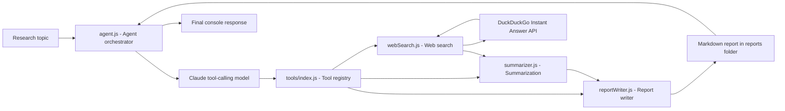

# Multi-Tool Research Agent

A lightweight Node.js AI agent that demonstrates tool orchestration, web research, summarization, and structured report generation using Claude tool calling.

The project is intentionally framework-light: it uses the Anthropic SDK, modular JavaScript tools, a small agent loop, and a file-based report output workflow. It is designed to show how an LLM-powered application can keep tool logic explicit, auditable, and easy to extend instead of hiding orchestration behind a heavy framework.

---

## What This Demonstrates

This project demonstrates several production-relevant AI engineering patterns:

- LLM tool orchestration with explicit tool schemas
- Separation between model reasoning and application-owned tool execution
- Modular tool design for search, summarization, and report writing
- File-based output workflow for auditable generated artifacts
- Local secret management using environment variables
- Safety-aware handling of external web content
- A framework-light architecture that is easy to inspect, test, and extend

---

## Features

- Claude-powered agent loop using the Anthropic SDK
- Modular JavaScript tool registry with explicit tool schemas
- Web search tool using DuckDuckGo Instant Answer API
- Dedicated summarization tool for bounded, auditable summarization
- Report writer tool that saves structured Markdown reports
- Optional one-shot daily research scheduler
- Local `.env` configuration for API keys and scheduler settings
- File-based report workflow designed for easy review, debugging, and extension
- Tool-call trace logging to local JSONL files for debugging and auditability
- Source ranking and citation quality checks for search results

---

## Architecture



---

## How the Agent Works

1. **User provides a research topic**

   The topic can be entered interactively or passed as a command-line argument.

2. **`agent.js` starts the Claude tool-calling loop**

   The agent sends the topic, system prompt, and available tool schemas to Claude.

3. **Claude requests `web_search`**

   The tool searches DuckDuckGo's Instant Answer API and returns structured search snippets.

4. **Claude requests `summarizer`**

   The collected search text is passed to a dedicated summarization tool. This keeps summarization as an auditable tool step instead of hidden model reasoning.

5. **Claude requests `report_writer`**

   The report writer receives the topic, executive summary, key findings, sources, and next steps.

6. **A Markdown report is saved**

   Reports are written to:

   ```text
   reports/YYYY-MM-DD-topic.md
   ```

7. **The agent returns a short completion message**

   The final console response confirms where the report was saved and summarizes the result.

---

## Project Structure

```text
multi-tool-research-agent/
├── agent.js                         # Main agent loop and CLI entrypoint
├── tools/
│   ├── index.js                      # Tool schemas and dispatcher
│   ├── webSearch.js                  # DuckDuckGo Instant Answer API tool
│   ├── summarizer.js                 # Claude-powered summarization tool
│   └── reportWriter.js               # Markdown report writer
├── scheduler/
│   └── daily.js                      # One-shot daily research job
├── reports/
│   └── .gitkeep                      # Keeps reports directory in Git
├── .env.example                      # Environment variable template
├── .gitignore
├── package.json
├── package-lock.json
├── LICENSE
└── README.md
```
---

## Prerequisites

- Node.js 18+
- npm
- Anthropic API key

Node.js 18+ is required because the project uses native `fetch`.

---

## Setup


Install dependencies:

```bash
npm install
```

Create a local environment file:

```bash
cp .env.example .env
```

Add your Anthropic API key to `.env`:

```env
ANTHROPIC_API_KEY=your_anthropic_api_key_here
```

No search API key is required. The `web_search` tool uses DuckDuckGo's free Instant Answer API.

---

## Run the Agent

### Interactive mode

```bash
npm start
```

Then enter a research topic when prompted:

```text
Topic: AI governance trends
```

Type `exit` or `quit` to stop the agent.

### One-off research run

```
node agent.js "latest developments in AI governance"
```

### Scheduled research run

```bash
npm run scheduler
```

The scheduler is a one-shot script. It runs once and exits. Use cron, launchd, or another system scheduler if you want it to run automatically every day.

---

## Environment Variables

| Variable | Required | Description |
|---|---:|---|
| `ANTHROPIC_API_KEY` | Yes | Anthropic API key used by the agent and summarizer |
| `DAILY_TOPIC` | No | Topic used by `scheduler/daily.js` |
| `DAILY_PROMPT` | No | Full custom prompt for scheduled research |

Example:

```env
ANTHROPIC_API_KEY=your_anthropic_api_key_here
DAILY_TOPIC=latest developments in AI governance
```

---

## Tools

### `web_search`

Searches DuckDuckGo's Instant Answer API and returns formatted result snippets.

Important limitation: DuckDuckGo Instant Answer is not a full general-purpose web search API. It works best for known topics, entities, and concepts. For breaking news or broad web search, results may be thin.

### `summarizer`

Uses Claude to condense collected search text into concise key bullet points. This is separated into its own tool so the workflow remains explicit and auditable.

### `report_writer`

Writes a structured Markdown report with these sections:

- Executive Summary
- Key Findings
- Sources
- Next Steps

Filenames are generated from sanitized topic slugs to avoid unsafe file paths.

---

## Report Output

Reports are saved in the `reports/` directory:

```text
reports/YYYY-MM-DD-topic-slug.md
```

Generated reports are ignored by Git so local research output does not get committed accidentally. The repository keeps `reports/.gitkeep` so the directory exists after cloning.

---

## Possible Future Improvements

- Add a stronger search provider with richer result metadata
- Add retry and timeout handling for tool execution
- Store reports and run history in PostgreSQL
- Add a lightweight web dashboard for report review
- Add tests for tool dispatching and report generation
- Add Docker support for reproducible local execution

---

## Development Commands

```
npm install
npm start
node agent.js "your research topic"
npm run scheduler
```

---


## License

This project is licensed under the MIT License. See [LICENSE](LICENSE) for details.
